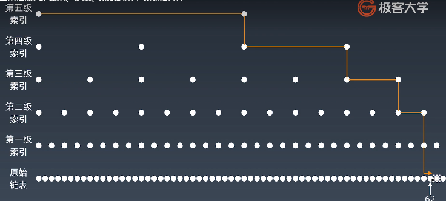

## 学习笔记

### Part 1:
- **Array:**
    - Memory controller 
	- Look up any element in an array take same time O(1)
	- When insert an element, copy element from target index to end, move them to target index +1. Then add new element to target index O(n)
	- When remove an element, copy element from target index to end, then remove element at  target index. move copied elements to target index. O(n)
- **Linked list:**
	- Every element have a value and a next value points to the next element
	- Two-way linked list, have one more value that points to previous element
	- Last element's next value is null, or it can point to first element of the list
	- When insert an new node, next pointer of the last element points to new node, the next pointer of the new element points to the next element. only 2 operations O(1)
	- When remove an new node, next pointer of the last element points to node after the target node. only 1 operations O(1)
	- When look up any element in the list, you have to start from beginning of the list to the target position O(n)
- **Skip list:**
	- List must be in order, O(log n) for insert/delete/look up
	-  To replace Balanced Binary Tree when list is in order
	to optimize one dimensional data type usually transform it to two dimensional data type
    
	- Loop up faster then Linked list O(log n)
	- Inert and remove element is more complex, need to update each layers O(log n)
	- Space Complexity is O(n) 
### Part 2:
- Finish every challenge 5 time, 
### Part 3:
- When you have no idea on a code challenge, try to manually list all situations. And try to look for closest repeatable pattern.
basic tools to write program:
	- if else
	- for while
	- recursion